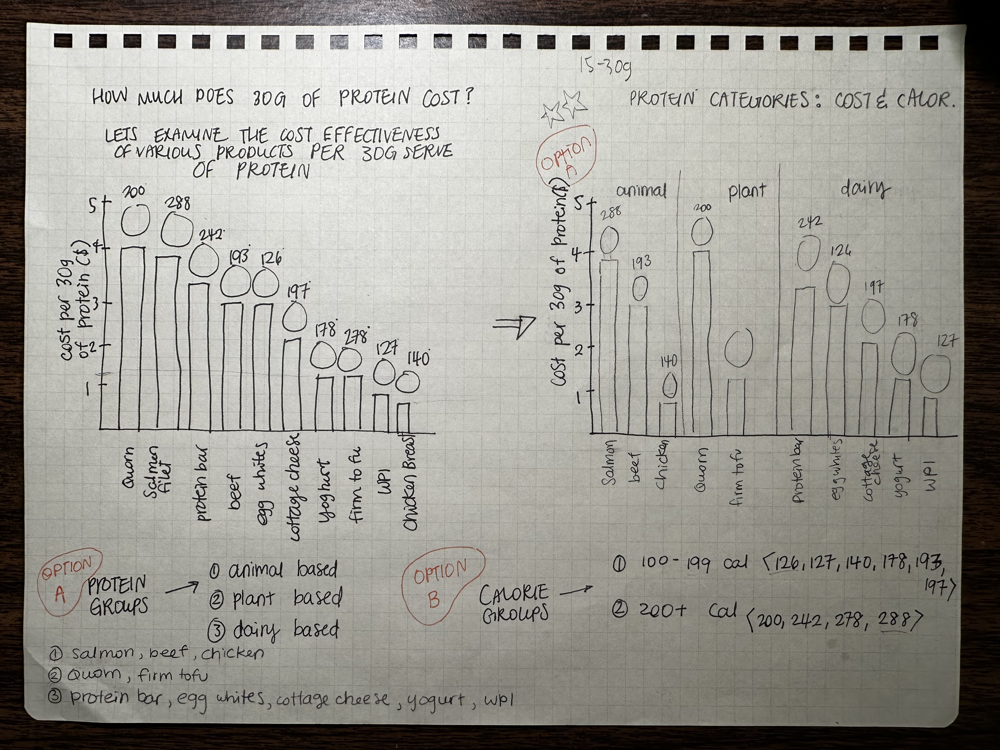
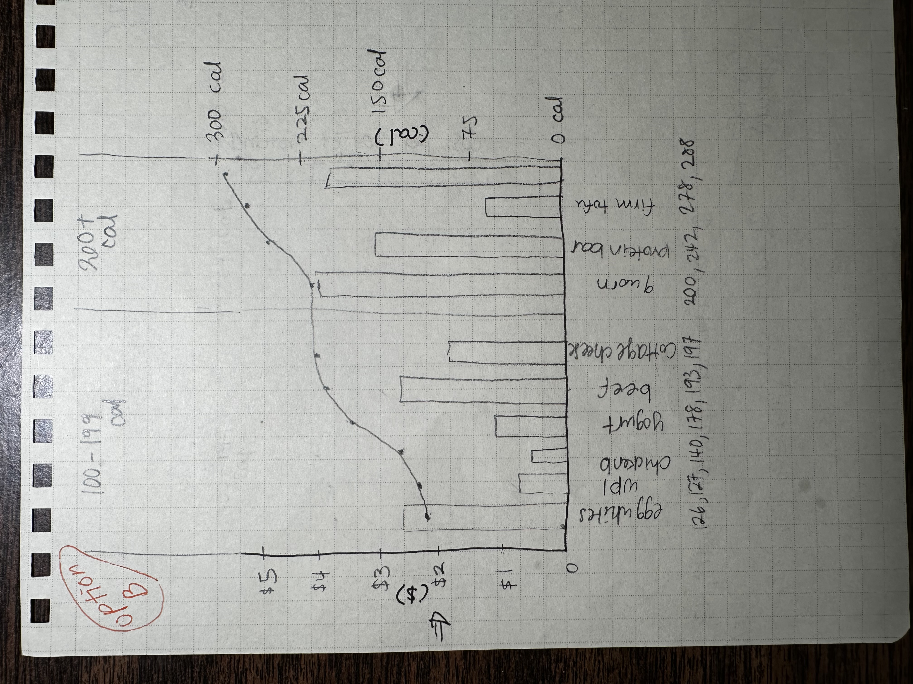

| [Home Page](https://ellenasakai.github.io/sakaiportfolio/) | [Visualizing Government Debt](governmentdebt) | [Visualizing Protein Costs and Categories](protein) | [Final Project I](final-project-part-one) |

# Assignment: Critique by Design with Tableau (MakeoverMonday)
  1. Select a Visualization to redesign from MakeoverMonday
  2. Critique the Visualization
  3. Sketch out a Solution
  4. Test the Solution
  5. Build Your Solution

## 1. Select a Visualization to redesign from MakeoverMonday
> Original Visualization: [The Cheapest Ways to Get Your Protein Summary](https://www.thebodybuildingdietitians.com/blog/how-cost-effective-is-your-high-protein-diet)

 

## 2. Critique the Visualization
> Using Stephen Few's [Data Visualization Effectiveness Profile Criteria](http://www.perceptualedge.com/articles/visual_business_intelligence/data_visualization_effectiveness_profile.pdf), the above visualization got the following scores...

  - Usefulness: 8
  * Completeness: 6
  * Perceptibility: 6
  * Truthfulness: 6
  * Intuitiveness: 9
  * Aesthetics: 6
  * Engagement: 9

**Question**: Describe your overall observations about the data visualization here.  What stood out to you?  What did you find worked really well?  What didn't?  What, if anything, would you do differently?   
**Answer**: Overall, I believe the data visualization does a successful job of getting the story across. It was clear from the start that our story focuses on the cost of various protein products. While critiquing the visualization, I noticed I heavily focused on the images and only referred to the X-Axis labels when I was not able to determine the product from the image. The images play a critical role in the success of this visualization; without it, the aesthetics would have received a lower score. The visualization is complete and useful for an audience group that wants to understand or compare price, calorie count, and different protein items. At first glance, I started comparing the calorie values written on the bar charts with the cost per 30g of protein ($) which was very confusing. It was also misleading to see calorie counts increasing/decreasing in value when the bars were visually descending. To combat this confusion, I would suggest creating another section for the calories. In terms of audience, I think the visualization would benefit from having the following categories: Animal-based, Plant-based, and Dairy-based protein. This would enable the audience members to pick their category of choosing depending on their health considerations, views on animal cruelty, religious beliefs, and/or other personal preferences, creating a more inclusive and tailored story for each individual. 
> *Additional notes:*
  It might be useful to add to the visualization a simple note that states prices of products are subject to change due to inflation. 
  It might also be useful to include that 30G is not random-- it is the average amount of protein an average person should consume in a meal.

**Question**: Who is the primary audience for this tool?  Do you think this visualization is effective for reaching that audience?  Why or why not?  
**Answer**: The primary audience would be us humans who consume protein. Given that cost is a significant factor for many, this visualization facilitates optimal price and product comparisons. Furthermore, if ordering bulk products such as a restaurant, this visualization opens avenues for decision-making, allowing for the creation of a dish/menu with maximum calorie content while incorporating the most cost-effective alternative for a specific audience category as listed above. 

**Final Thoughts**: I found Stephen Few’s Data Visualization effectiveness profile to be an effective tool for critiquing visualizations. The truthfulness criteria was interesting to parse through as I started forming questions like “Is the price accurate? What about inflation? Are the calorie counts correct?”. I feel as if consistency can also be measured along with perceptibility as we want to be consistent with what our human eye and brain can follow. I am also wondering whether the visualization can tell the audience more of a story. Could there be a beginning, middle or end? Could we add a human figure/image that can help tell the story?

## 3. Sketch out a Solution

> **Sketch One**

> **Sketch Two**

## 4. Test the Solution

> Interview Results: *Interviewee #1*

| Questions | Student, early 20's |
|-----------|---------------------|
| Can you tell me what you think this is? | "This is a bar chart with different types of protein." |
| Can you describe to me what this is telling you? | "This graph is telling me the cost per 30 grams of protein for three different categories of protein: Animal, plant, and dairy. It also includes the amount of calories for each different, specific type." |
| Is there anything you find surprising or confusing? | "Just from looking at the graph, I find it difficult to understand whether the calorie counts are for each specific type of protein. I’m not too sure whether these counts are for a 30g serving or for 1 serving size as is generally recommended for a 2000 calorie diet. I find it surprising that tofu has more calories per serving than chicken, but the lack of inclusion of the actual calorie count makes it difficult to compare with yogurt. I understand that you probably just forgot to include it, but it should be there." |
| Who do you think is the intended audience for this? |	"I feel like the intended audience is people who are interested in saving money, but healthily maximizing their protein intake. Also people who have different dietary restrictions would appreciate the separation of the highest-level categories of proteins." |
| Is there anything you would change or do differently? | "If there was anything I’d change about the graph it would be to include a caption briefly explaining the calorie counts or to include it in the title/subtitle of the graph. Also, maybe providing the calories as different data points and having a third axis on the right-hand side might help compare the calories better." |

> Interview Results: *Interviewee #2*

| Questions | Student, Mid 20's |
|-----------|---------------------|
| Can you tell me what you think this is? | "A graph comparing the cost per 30 graphs of protein between different food sources." |
| Can you describe to me what this is telling you? | "That plant protein (quorn specifically) has the highest cost per 30grams of protein of all the listed foods on the chart." |
| Is there anything you find surprising or confusing? | 	"Not really." |
| Who do you think is the intended audience for this? | "Dieticians, people considering a new diet or wanting to find alternative and cheaper sources of protein." |
| Is there anything you would change or do differently? | "I feel like it might make more sense to lay the graph out horizontally? Quoarn Salmon and Protein bars have the largest bar which initially made me think they were good at whatever the chart was identifying, but if they have the highest cost per 30g then they are the options I wouldn’t want. If the graph was laid out horizontally without categories, having the lowest cost per 30g at the top then it might visually represent that those are the best options more clearly, although it depends on what the goal of the chart is I suppose." |

> Interview Results: *Interviewee #3*

| Questions | Student, Mid 30's |
|-----------|---------------------|
| Can you tell me what you think this is? | "Breaking protein out by price and type." |
| Can you describe to me what this is telling you? | "I think you’re trying to break protein type out by category." |
| Is there anything you find surprising or confusing? | "I don’t know what the circles at the end on the bars mean & your say per 30 g of protein but you count by ones & what is WPI." |
| Who do you think is the intended audience for this? | "All those who want to find out how much protein they are in taking." |
| Is there anything you would change or do differently? | "Move plant, animal, and dairy to the bottom and use color to categorize." |

> Interview Results: Overall Analysis

| Questions | Similarities | Differences |
|--------------|-------------|-------------|
| Can you tell me what you think this is? | * similar assessments of what the graph is, generally able to decipher what is going on | N/A |
| Can you describe to me what this is telling you? | * similar understanding of protein categorization | * Interviewee 2 concluded **quorn** had highest cost of protein out of all foods |
| Is there anything you find surprising or confusing? | * Interviewee 1&3 found difficulty with units  | N/A |
| Who do you think is the intended audience for this? | *similar understanding of who the audience might be, in this case all three interviewees said people who are interested in their protein intake * Interviewee 1&2 focused on Cost | * Super interesting to see Interviewee 2s answer: where Dieticians would be the audience for this visualization (Something that did not cross my mind personally)|
| Is there anything you would change or do differently? | * similar conclusions in wanting to see a graph that is easier to read | * three different suggestions: (1) making calories easier to read, (2) formatting and organizing the costs so that it is obvious that cheaper, lower costs are preferred and better, (3) formatting and readability of the bars and x-axis labels|

## 5. Build Your Solution

> **Redesigned Visualization** : Bang for Your Buck: Protein and Calories

<noscript></noscript><object class='tableauViz'  style='display:none;'><param name='host_url' value='https%3A%2F%2Fpublic.tableau.com%2F' /> <param name='embed_code_version' value='3' /> <param name='site_root' value='' /><param name='name' value='BangforYourBuck-ProteinandCalories&#47;Dashboard2' /><param name='tabs' value='no' /><param name='toolbar' value='yes' /><param name='static_image' value='https:&#47;&#47;public.tableau.com&#47;static&#47;images&#47;Ba&#47;BangforYourBuck-ProteinandCalories&#47;Dashboard2&#47;1.png' /> <param name='animate_transition' value='yes' /><param name='display_static_image' value='yes' /><param name='display_spinner' value='yes' /><param name='display_overlay' value='yes' /><param name='display_count' value='yes' /><param name='language' value='en-US' /></object>
              

> **Redesigned Visualization Changes and Analysis**

*Talk about what your redesigned data visualization shows:*

My redesigned data visualization shows a comparison of Cost and Calorie Content per 30 grams of Protein. Specifically, the visualization allows for users to look at a specific category of Protein: Animal, Plant, or Dairy-based Protein. This decision was influenced by attempting to allow viewers to focus on their protein category of choice. For those who might not eat Animal-based protein, the original visualization did not allow viewers to sift through and compare plant and/or dairy products easily.

On the MakeoverMonday dataset website, the "The Cheapest Ways to Get Your Protein" link included (1) an article with a detailed breakdown of protein and prices for every **20 grams** of protein and (2) a chart that broke down protein prices and calories for every **30 grams** of protein. For my redesign, I decided to stick with the chart as I felt the 30 grams represented more of an accurate amount of protein **per meal** for the average individual. 

*What you attempted to show or do differently:*

I aimed to incorporate the calorie count into the visualization by taking a deliberate and focused approach to explore diverse ways of presenting this information. In the original visualization, placing the calorie count on top of each bar which was misleading as it forced the eyes to compare it with the Y-axis prices, despite the units being different. To combat this issue, I chose to use varying widths for each bar: narrower widths denoting fewer calories and wider widths representing higher calorie content. To further increase readability, I included the dollar values above the bar graphs and kept the images of products, recognizing their importance in comparing different items at a glance. Moreover, for streamlined organization and differentiation, I assigned distinct colors to specific protein categories, striving for consistency in associating each category with its respective/corresponding color. 

