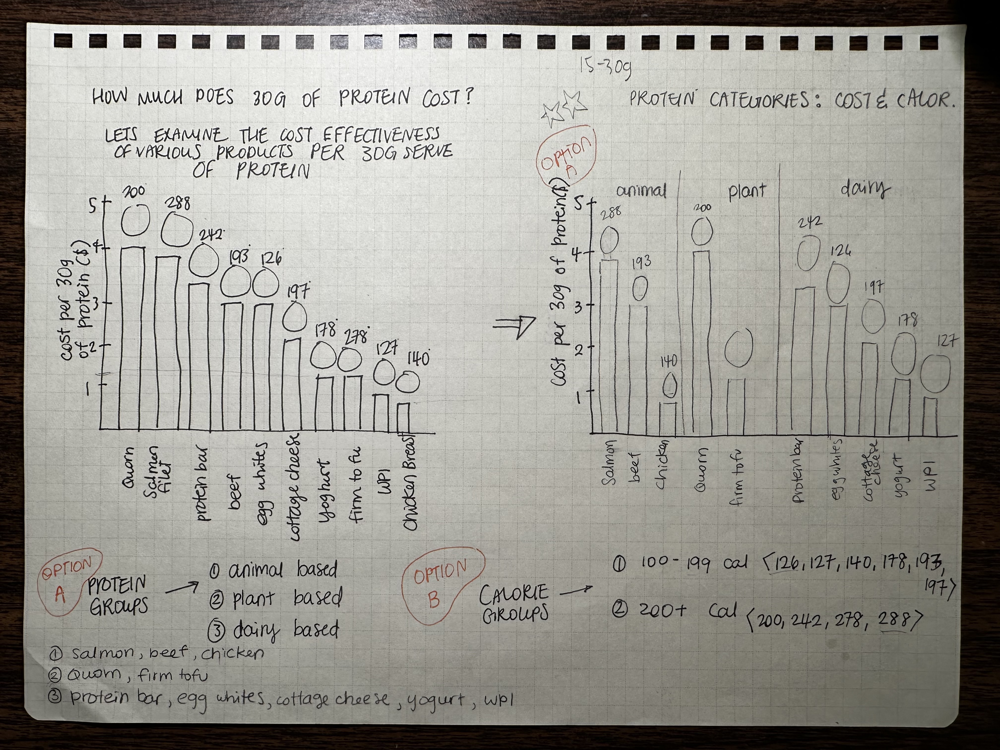

| [Home Page](https://ellenasakai.github.io/sakaiportfolio/) |  [Final Project I](final-project-part-one) | [Visualizing Government Debt](governmentdebt)  | [Visualizing Protein Costs and Categories](protein)

# Assignment: Critique by Design with Tableau (MakeoverMonday)
  1. Select a Visualization to redesign from MakeoverMonday
  2. Critique the Visualization
  3. Sketch out a Solution
  4. Test the Solution
  5. Build Your Solution

## 1. Select a Visualization to redesign from MakeoverMonday
> Original Visualization: [The Cheapest Ways to Get Your Protein Summary](https://www.thebodybuildingdietitians.com/blog/how-cost-effective-is-your-high-protein-diet)

 

## 2. Critique the Visualization
> Using Stephen Few's [Data Visualization Effectiveness Profile Criteria](http://www.perceptualedge.com/articles/visual_business_intelligence/data_visualization_effectiveness_profile.pdf), the above visualization got the following scores...

  - Usefulness: 8
  * Completeness: 6
  * Perceptibility: 6
  * Truthfulness: 6
  * Intuitiveness: 9
  * Aesthetics: 6
  * Engagement: 9

## 3. Sketch out a Solution

> Sketch One

> **Sketch Two**

## 4. Test the Solution

> Interview Results: Interviewee #1

| Questions | Student, early 20's |
|-----------|---------------------|
| Can you tell me what you think this is? | This is a bar chart with different types of protein. |
| Can you describe to me what this is telling you? | This graph is telling me the cost per 30 grams of protein for three different categories of protein: Animal, plant, and dairy. It also includes the amount of calories for each different, specific type. |
| Is there anything you find surprising or confusing? | Just from looking at the graph, I find it difficult to understand whether the calorie counts are for each specific type of protein. I’m not too sure whether these counts are for a 30g serving or for 1 serving size as is generally recommended for a 2000 calorie diet. I find it surprising that tofu has more calories per serving than chicken, but the lack of inclusion of the actual calorie count makes it difficult to compare with yogurt. I understand that you probably just forgot to include it, but it should be there. |
| Who do you think is the intended audience for this? |	I feel like the intended audience is people who are interested in saving money, but healthily maximizing their protein intake. Also people who have different dietary restrictions would appreciate the separation of the highest-level categories of proteins. |
| Is there anything you would change or do differently? | If there was anything I’d change about the graph it would be to include a caption briefly explaining the calorie counts or to include it in the title/subtitle of the graph. Also, maybe providing the calories as different data points and having a third axis on the right-hand side might help compare the calories better. |

> Interview Results: Interviewee #2

| Questions | Student, Mid 20's |
|-----------|---------------------|
| Can you tell me what you think this is? | xx |
| Can you describe to me what this is telling you? | xx |
| Is there anything you find surprising or confusing? | xx |
| Who do you think is the intended audience for this? | xx |
| Is there anything you would change or do differently? | xx |

## 5. Build Your Solution

Redesigned Visualization

<noscript></noscript><object class='tableauViz'  style='display:none;'><param name='host_url' value='https%3A%2F%2Fpublic.tableau.com%2F' /> <param name='embed_code_version' value='3' /> <param name='site_root' value='' /><param name='name' value='BangforYourBuck-ProteinandCalories&#47;Dashboard2' /><param name='tabs' value='no' /><param name='toolbar' value='yes' /><param name='static_image' value='https:&#47;&#47;public.tableau.com&#47;static&#47;images&#47;Ba&#47;BangforYourBuck-ProteinandCalories&#47;Dashboard2&#47;1.png' /> <param name='animate_transition' value='yes' /><param name='display_static_image' value='yes' /><param name='display_spinner' value='yes' /><param name='display_overlay' value='yes' /><param name='display_count' value='yes' /><param name='language' value='en-US' /></object>
              

